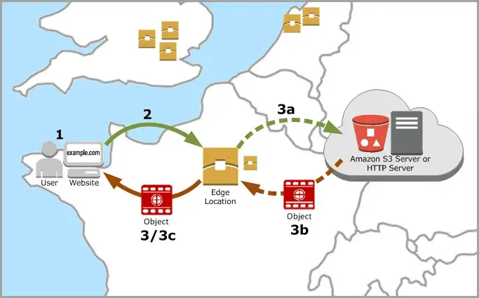

##### Table of Contents
- [CDN Fundamental](#cdn-fundamental)

#### CDN Fundamental
**What is CDN**? - CDN (Content delivery network) is a globally distributed network of edge servers that cache and serve content (static or dynamic)

**What is Edge server** - Edge servers are strategically located data centers around the world that store cached copies of content closer to end-users, reducing latency and improving load times.

_Let imagazine that you have a website hosted in New York, USA. When a user from London, UK tries to access your website, the request has to travel all the way to New York and back. This can result in significant latency and slower load times.
However, if you use a CDN with edge servers located in London, the user's request can be served from the nearest edge server, significantly reducing latency and improving the overall user experience._

#### AWS CDN Services - CloudFront
- It just a web service that speeds up distribution of your static and dynamic web content, such as .html, .css, .js, image, video.
- It delivers your content through a worldwide network of data centers called edge locations.
- Requests for your content are automatically routed to the nearest edge location.
- _If the content is not already cached at that location, CloudFront retrieves it from an origin that you define, such as an Amazon S3 bucket, an Amazon EC2 instance, or an HTTP server (like your web server)._
- _If the content is already cached at that location, CloudFront delivers it immediately to your viewers with the best possible performance._

_Example: You have image file named "sunset.png", serve at https://mywebsite.com/images/sunset.png.
Cloud Front will speeds up the request to your content by routed this request to nearest **Edge Location** provided by AWS and
your image will superfast instead your zone is **NewYork** and the client request is on **Tokyo**

#### How CloudFront Delivery your content
After get known as CDN and CloudFront, let see how **CloudFront** deliver your content to end user

1. A user accesses your website or application and sends a request for an object, such as an **image file or an HTML file**.
2. **DNS** routes the request to the **CloudFront POP (edge location)** that can best serve the request, typically the nearest **CloudFront POP** in terms of latency.
3. **CloudFront** checks its cache for the requested object. If the object is in the cache, **CloudFront** returns it to the user. If the object is not in the cache, CloudFront does the following:
    - **a**. **CloudFront** compares the request with the specifications in your distribution and forwards the request to your **origin server** for the corresponding object—for example, to **your Amazon S3 bucket or your HTTP server**.
    - **b**. The origin server sends the object back to the **edge location**.
    - **c**. As soon as the **first byte** arrives from the origin, CloudFront begins to **forward the object to the user**. **CloudFront** also adds the object to the **cache** for the next time someone requests it.

_Yes, **CloudFront** will cache your content at edge location for next time request, we will deep dive to **cache** latter._

#### Edge Servers
See the list of the locations of CloudFront edge servers around the world: [Edge Server list](https://aws.amazon.com/cloudfront/features/#Global_Edge_Network)