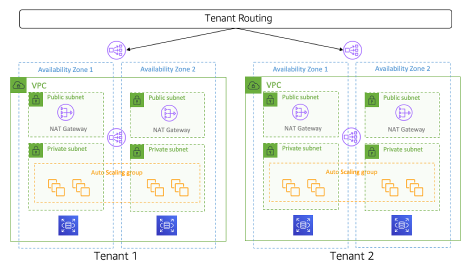

import QuestionQuizz from '../../components/QuestionQuizz.astro';

#### Table of Contents
- [Core components](#introduction)
- [Create a VPC](#learning-path)
- [Questions for practice](#content-outline)

### Key Concepts
A Virtual Private Cloud (VPC) is a logically isolated section of the cloud provider’s network where you can launch resources in a virtual network you define.

##### How VPC works

1. **VPC Isolation**: Each VPC is completely separated from others, Resources (like servers or databases) in one VPC can’t talk to resources in another VPC unless you set up a special connection, like **VPC peering or a VPN**.

_This is example about basic vpc, the resource on VPC **Tanent 1** cannot access to resource on VPC **Tanent 2**_
2. When someone tries to access your app (for example, from a web browser or a mobile app), the traffic first enters **AWS** and heads toward your **VPC**.

3. Every resource you create (like an EC2 server or database) is placed inside a subnet. Subnets are an AWS design that helps you improve security and control which services or users can access your resources.
4. We have 2 type of subnet:
    - **Public subnet**: Connected to the internet via an **Internet Gateway (IGW)** - A special door designed by aws.
    - **Private subnet**: No directly connect to the internet, it often use for private resource, Can access the internet via NAT Gateway if needed.

5. Each subnet in your VPC uses a Route Table. **When traffic enters your VPC**, the **Route Table** decides where it should go next—like which subnet or server.
6. The another resource need to note is **Availability Zone** (AZs), the **AZs** design to high availability, disaster recovery, load balancing. Each subnet must included in on **AZ** - That is design constrait

##### Create your first VPC

- Real project: Base on aws network labs https://catalog.workshops.aws/networking/

_Note: capture screen then puts it on here_

##### Questions

<QuestionQuizz 
    content = "1. What is network?" 
    answers = {["A. VPC", "V. Test", "C. Controller"]}
    correctAnswers = {[0, 2]}
    type = "multiple"
    explaination = "Network is a collection of computers, servers, mainframes, network devices, peripherals, or other devices connected to one another to allow the sharing of data. A network can be as small as two computers or as large as millions of devices."
/>